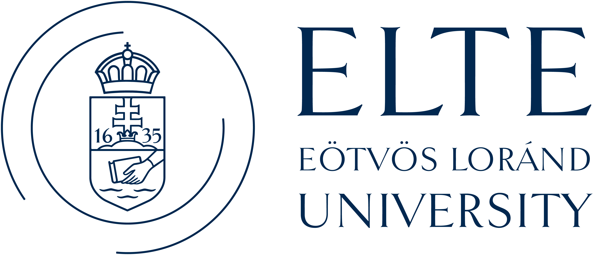

# 👋 About Me
I am Német-Deák Bence from Transylvania. I currently study at **Sapientia Hungarian University of Transylvania** at the Tg Mureș campus.

---

# 💻 My Projects

### 📖 The Odin Project 📖 
- 📋 [Admin Board](https://github.com/Munlaly/AdminBoard)
- 🧮 [Calculator](https://github.com/Munlaly/Calculator)
- 🎨 [Etch A Sketch](https://github.com/Munlaly/Etch-A-Sketch)
- ✂️ [Rock Paper Scissors](https://github.com/Munlaly/Rock_Paper_Scissor)
- 🔑 [Signin Form](https://github.com/Munlaly/Signin-Form)
- ⭕ [Tic Tac Toe](https://github.com/Munlaly/TicTacToe)
- 📚 [Library](https://github.com/Munlaly/Library)
- 🍽️ [Restaurant Page](https://github.com/Munlaly/Restaurant-Page)

### 🏫 Sapientia University 🏫 
- ⏭️ [Skiplist](https://github.com/Munlaly/SkipList)
- 🕸️ [Graph Algorithms](https://github.com/Munlaly/Graph-Theory)

### ✈️ Erasmus Semester at Eötvös Loránd University (Budapest) ✈️ 
- 🍇 [Vineyard Management System](https://github.com/Munlaly/Vineyard-Management-System) - *Operating Systems*
- 📜 [QuestLog](https://github.com/Munlaly/Quest-Log-Manager) - *Object-oriented Python CLI for quest and inventory management*
